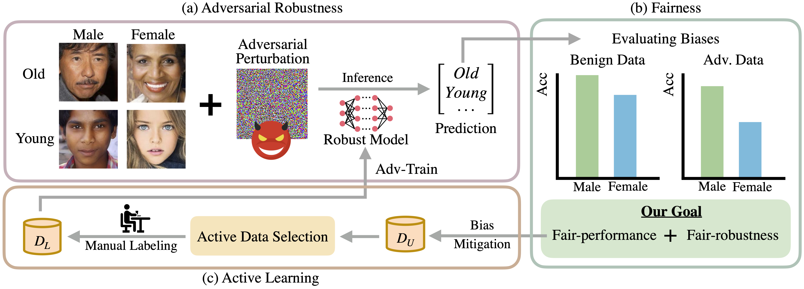

# Fair Robust Active Learning by Joint Inconsistency

Official pytorch implementation of ["Fair Robust Active Learning by Joint Inconsistency. Wu et al. ICCVW (AROW) 2023."](https://arxiv.org/abs/2209.10729).

## TL; DR

Observing safety-critical needs in various annotation-expensive vision applications, we introduce a novel learning framework, Fair Robust Active Learning (FRAL), generalizing conventional active learning to fair and adversarial robust scenarios. With this introduced framework and our proposed joint inconsistency active data selection method, we are able to achieve standard and robust minimax fairness with limited acquired labels.

## Quick Start

We will release our code soon.
